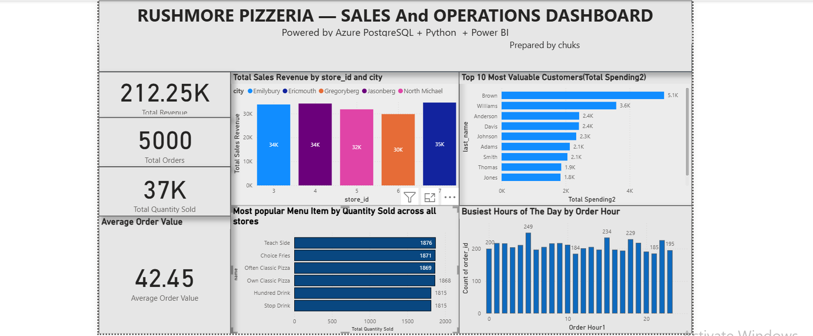
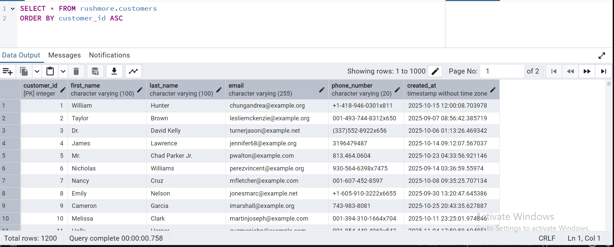
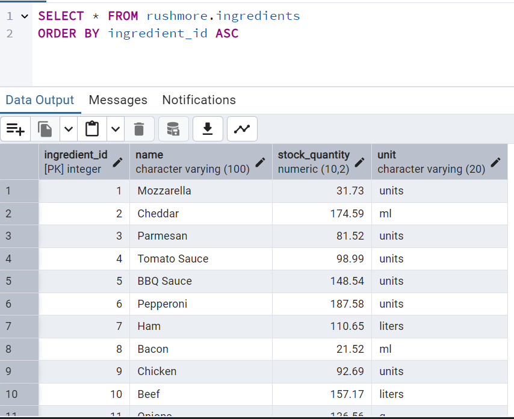
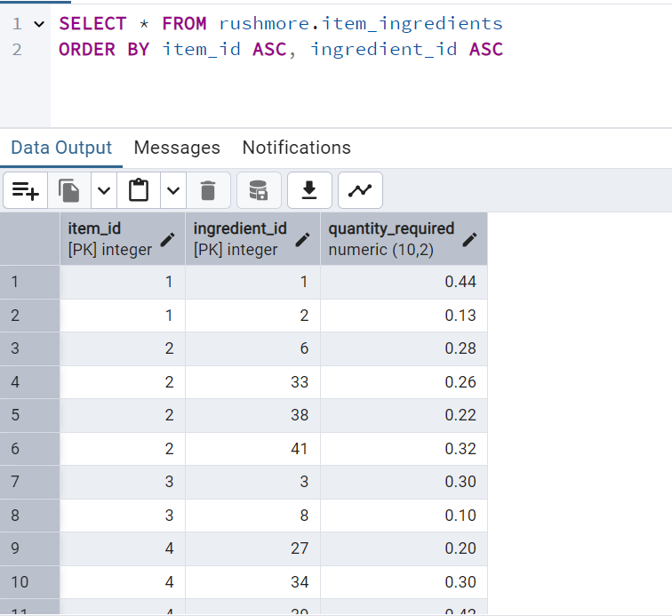
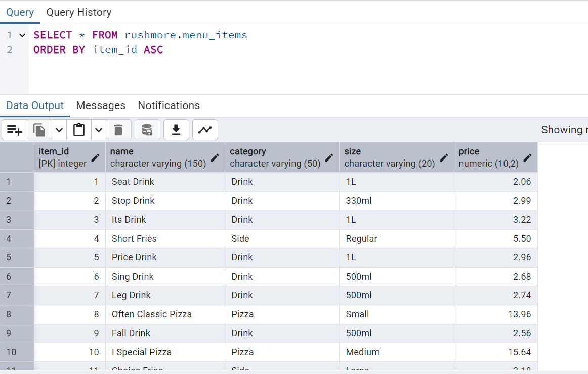
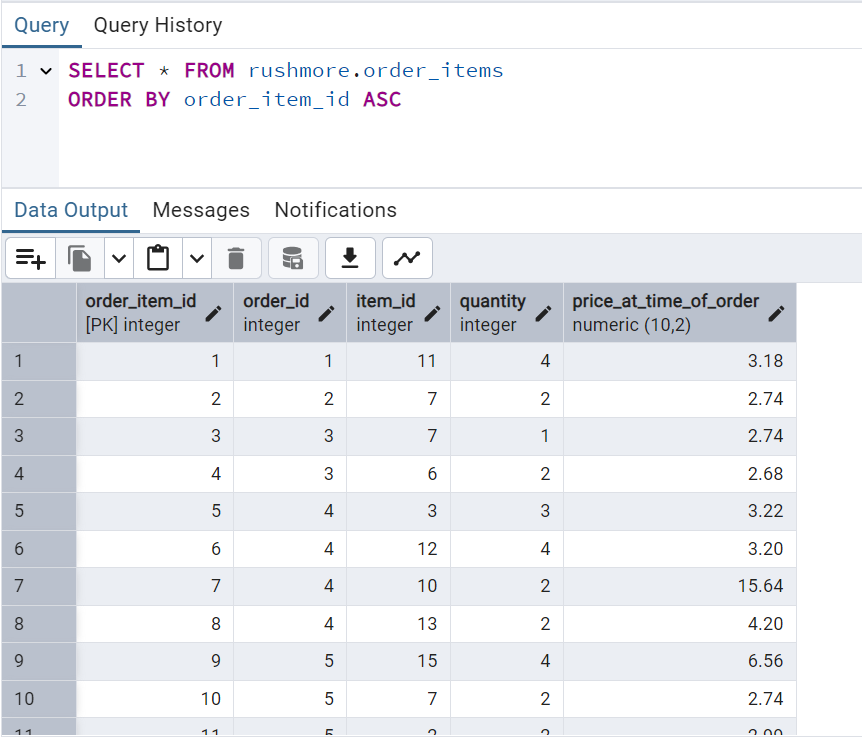
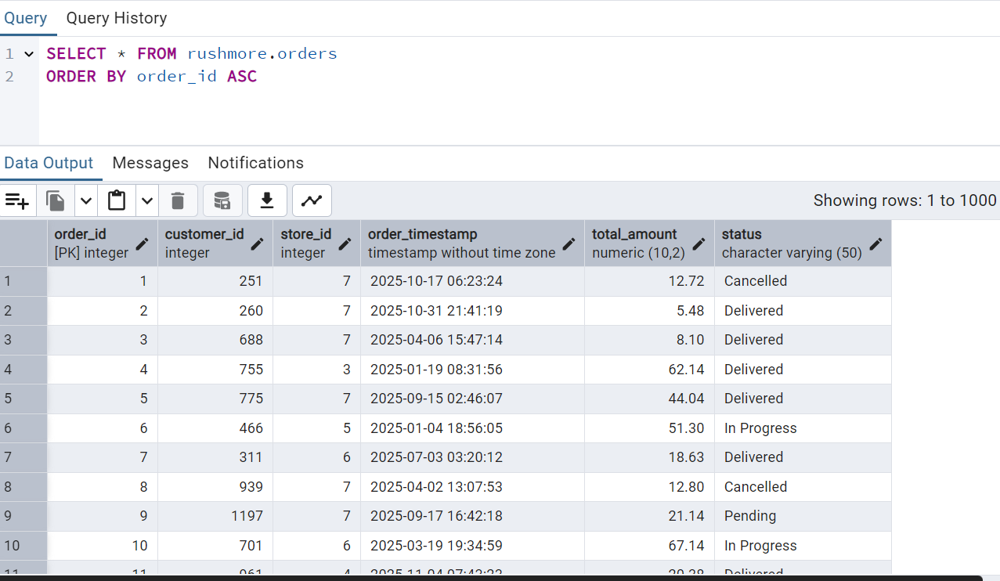
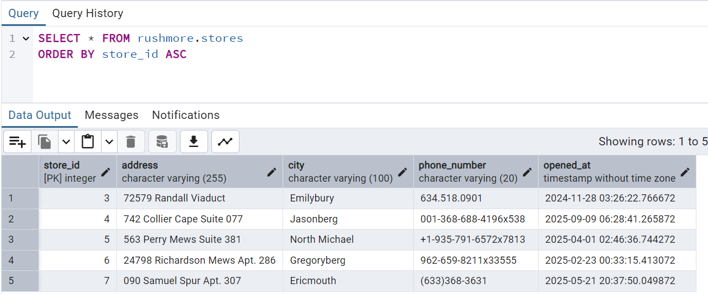

## RushMore Pizzeria Enterprise Database System (Azure postgreSQL + python + powerBI)
### Project Overview

RushMore Pizzeria originally operated using a simple Python ordering app backed by a single JSON file. While this worked for early prototypes, the business soon expanded into multiple locations, thousands of customers, and fast-growing order volume. At that point, JSON became a bottleneck—slow, fragile, and impossible to query or share across users.

To support RushMore’s growth, I engineered a complete migration from JSON storage to a full enterprise-grade PostgreSQL database deployed on Microsoft Azure. I also generated 10,000+ realistic synthetic records using Python (Faker + psycopg2) to populate the system with production-ready test data.
Finally, I connected Azure PostgreSQL to Power BI to build interactive dashboards that answer real business questions across sales, customers, inventory, and store performance.

This README provides:

Full system architecture
Database ERD
SQL schema
Python automation (data generation)
Cloud deployment steps
Power BI analytics dashboards 
Screenshots (Azure portal and pgAdmin )

Tech Stack: 
Azure PostgreSQL Flexible Server - Cloud database.
Python (psycopg2, Faker, python-dotenv) - Programming

PostgreSQL, Normalization (3NF) - Data Modeling

Visualization  - Power BI 

IDE - VS Code

Admin Tool - pgAdmin 4

Version Control - 	Git + GitHub

## Database Architecture

## Rushmore ERD

## Database Schema Summary
```sql
1️⃣ Stores

store_id (PK)

address

city

phone_number

opened_at

2️⃣ Customers

customer_id (PK)

first_name, last_name

email

phone_number

created_at

3️⃣ Ingredients

ingredient_id (PK)

name

stock_quantity

unit

4️⃣ Menu_Items

item_id (PK)

name

category

size

price

5️⃣ Item_Ingredients (composite PK)

item_id (FK)

ingredient_id (FK)

quantity_required

6️⃣ Orders

order_id (PK)

customer_id (FK)

store_id (FK)

order_timestamp

total_amount

status

7️⃣ Order_Items

order_item_id (PK)

order_id (FK)

item_id (FK)

quantity

price_at_time_of_order.
```

### Analytics Dashboards (Power BI)

Using the Azure cloud database, I built dashboards answering the key business questions.
### Rushmore Dashboard


### Screenshots
1. Azure PostgreSQL Server


2. pgAdmin – Tables with Row Counts:
(a) Customers table

(b) Ingredients table

(c) Item_ingredient table

(d) Menu_item table

(e) Order_item table

(f) Orders table

(g) Store table



### Key Challenge:
 Azure Networking and Firewall.
 The biggest challenge was connecting to Azure PostgreSQL from Python and pgAdmin. Azure blocks ALL external connections by default.
Python/Faker scripts failed due to firewall restrictions.
 
 I resolved by configuring public access, and whitelisting allow IP.
 
 
 In conclusion,this project showcases a complete transformation of RushMore Pizzeria’s operations from a single-file prototype into a cloud-ready, analytics-powered enterprise system.

By migrating to Azure PostgreSQL, implementing a fully normalized database design, and automating data generation with Python, RushMore now has a scalable backend suitable for multi-store, high-volume operations. Connecting the cloud database to Power BI further enables real-time insights across sales, customers, inventory, and store performance.

Overall, this project demonstrates practical experience in:

Cloud database deployment

Production-level relational modeling

Secure connectivity & SSL configuration

Python-based ETL/data automation

BI dashboard design

Enterprise system architecture

It reflects the technical depth, problem-solving ability, and end-to-end engineering mindset expected of a modern Data Engineer.